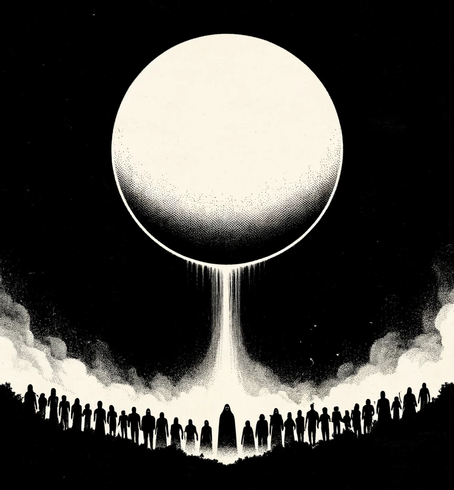

# Terra Odd

**Terra Odd** is a modular implementation or Cairn / Into the Odd that aims to allow games in to be played in different genres and aesthetics.

Character generation is quick and random, background based, and relies on fictional advancement rather than through XP or level mechanics. 

This webpage and the repository are a fork from [Yochai Gal](https://newschoolrevolution.com).'s Cairn.
Cairn is based on [Knave](https://www.drivethrurpg.com/product/250888/Knave) by Ben Milton and [Into The Odd](https://chrismcdee.itch.io/electric-bastionland) by Chris McDowall. 

<p></p>




## Contribute


Tech:

- install jekyll [mac](https://jekyllrb.com/docs/installation/macos/)

````
echo '3.1.3' >> .ruby-version
gem install bundler jekyll
bundle install

````

on repo folder


```
bundle exec jekyll serve
```
=> Now browse to http://localhost:4000

You can make real time changes in the files, and the state of your simulated site will reflect.

if error


```
bundle clean --force
gem update
bundle add webrick
```
