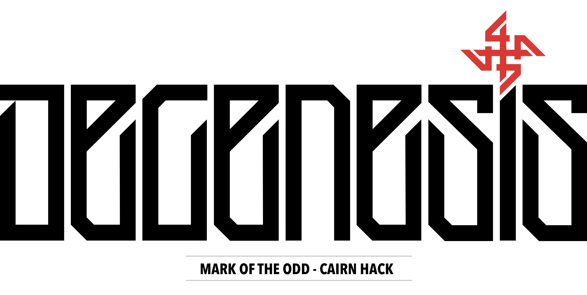

# Terra Odd
***v0.1.1***

**Terra Odd** is a hack of Cairn / Into the Odd that aims to allow games to be played in different genres and aesthetics.
The first hack is for [Degenesis](https://degenesis.com/).

The main difference is the addition of a modular [Woe mechanic](core-rules.md#Woe), based on [Oddular Mechanics](https://www.bastionland.com/2016/04/oddular-mechanics.html?m=1).
Woe differs narratively, depending on the game theme.
It can be used as infection, corruption, panic, sadness, insanity, etc.

Inventory slots are treated as Burdens and there is an expansion of Backgrounds, for different themes.

This repo also contains my GM materials for planning & running sessions.
It is not always organised.

This webpage and the repository are a fork from [Yochai Gal](https://newschoolrevolution.com).'s [Cairn](https://cairnrpg.com/).
Cairn is based on [Knave](https://www.drivethrurpg.com/product/250888/Knave) by Ben Milton and [Into The Odd](https://chrismcdee.itch.io/electric-bastionland) by Chris McDowall. 



<p></p>

## Contribute

Feel free to suggest edits on any files on this repo through Pull Requests.
Merged Pull Requests automatically builds the website.
If you want to localhost the website for testing purposes, you need to install jekyll ([instructions for macOS](https://jekyllrb.com/docs/installation/macos/))

After doing so, navigate to the repository folder and execute the following commands;

```
echo '3.1.3' >> .ruby-version
gem install bundler jekyll
bundle install
```

You are now able to localhost the website.
You can do so by:

```
bundle exec jekyll serve
```

and then browse to http://localhost:4000.

You can make real time changes in the files, and see result on your browser.

### Versioning

Given a version number MAJOR.MINOR.DEV, increment the:

+ MAJOR version when the new version is incompatible with previous versions (exception for 1.x)
+ MINOR version when a version with added features is to be used in a game session
+ DEV version when developments in-between sessions are published, or only fixes are applied.